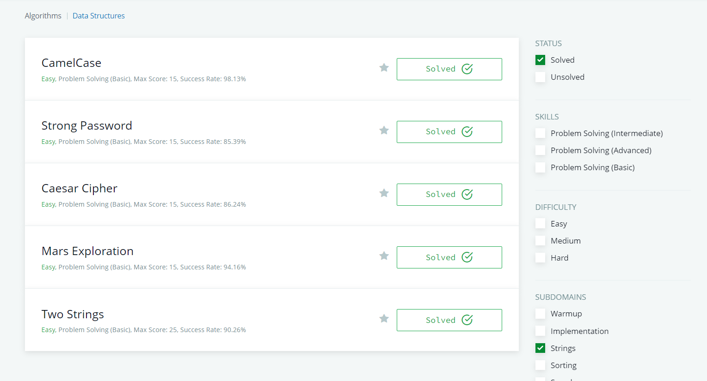

1.) [TaskNumberOne](https://codepen.io/TheHamidov/pen/BaJERJo)

2.) [TaskNumberTwo]() // alinmadi davam edecem

3.) [TaskNumberThree]() // 2-ci alinmadiqi ucun dolayisiyla buda alinmadi

4.) [TaskNumberFour](https://codepen.io/TheHamidov/pen/yLprbWp)

5.) [TaskNumberFive]() // vaxt catmadi davam edecem

