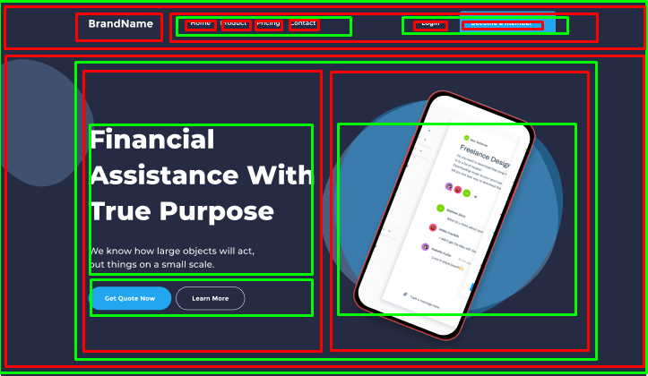
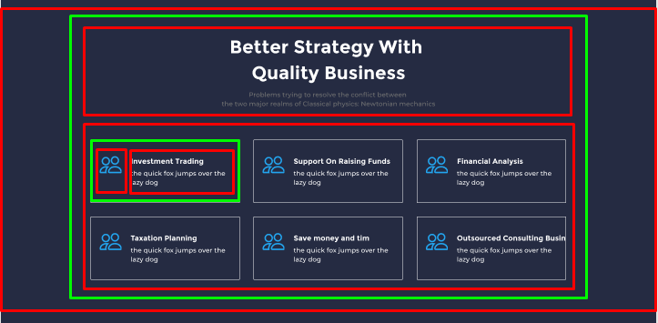
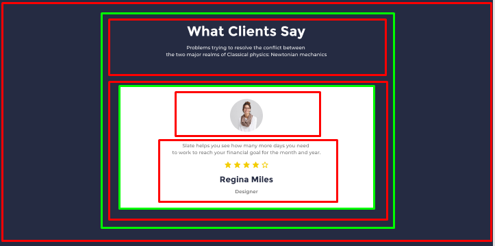
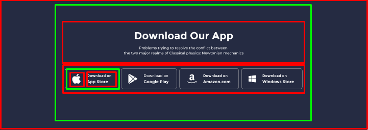
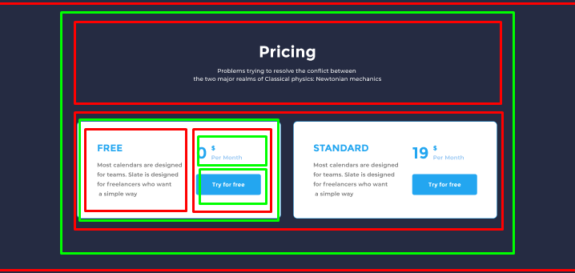
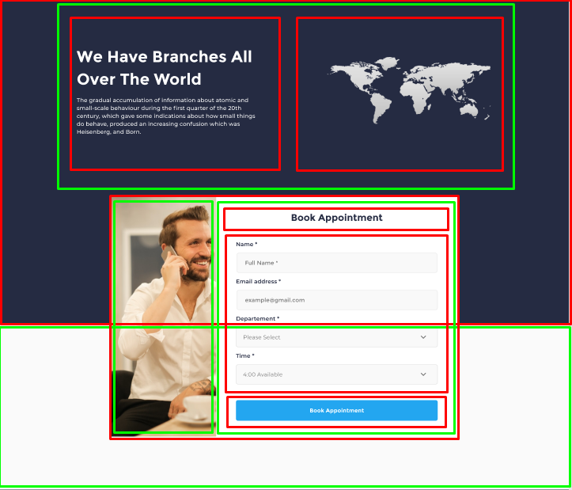
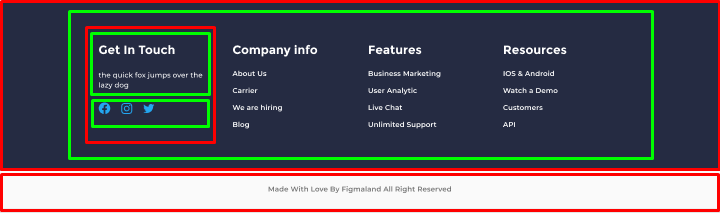

## Lesson-03 [15/01/2022] 

- Lesson
    - [Content](https://github.com/PragmatechEducation/FrontEnd03#day03--15-january-2022-namingconventioninaction)
    ```
        01) CSS Naming Convention
            > Camel Case
            > Pascal Case
            > Kebab Case

        02) BEM

        03) Css
            > Css Grid
            > Css FlexBox 
            > Css Position
    ```
    - [My Documentation](https://github.com/RaviHamidov/PragmatechFrontEndProject/blob/main/ReSearch.md)
- Task
    - [Content](https://github.com/PragmatechEducation/FrontEnd03#day03--15-january-2022-namingconventioninaction)
    ``` 
        01) Select a template and perform the following processes in sequence
                 > WireFrame developed with LightShot ( I placed it below )
                 > Html structure and naming followed
                 > Kebab Case naming method was used
                 > Css of the project was written

        02) The task has been uploaded to a repo called NamingConventionAction
    ```
    - [Solution](https://github.com/RaviHamidov/PragmatechFrontEndProject/tree/main/Works/FinanceProject)
    <br>
    <br>
    <br>
     
     
    
    
    
    
     