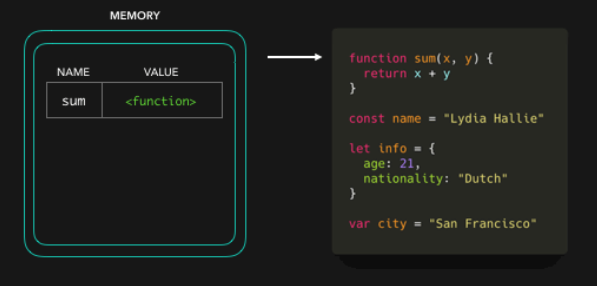

## Lesson-01 [08/01/2022] & Lesson-02 [09/01/2022]

- Question: Basic Git Commands and meanings.

    ```
        > git init => Create an empty Git repository or reinitialize an existing one

        > git status => Show the working tree status

        > git add . => Add file contents to the index
 
        > git commit -m "Comment" => Record changes to the repository

        > git branch -M main => List, create, or delete branches

        > git log => Show commit logs

        > git remote => Manage set of tracked repositories

        > git push -u origin main/master => Update remote refs along with associated objects
    ```

## Lesson-03 [15/01/2022] & SelfReSearch

- Question: CSS Naming Convention 

    ```CSS
    > Most commonly used naming styles :

        > BEM
            .menu {
                /*
                    Some styles for 
                    menu here 
                */ ( <= Block )                                          

                &__item {
                    /* 
                        Some tyles for 
                        .menu__item here 
                    */ ( <= Element ) 

                    &--active {
                        /* 
                            Specific styles to the active 
                            .menu__item--active status 
                        */ ( <= Modifiers ) 
                    }

                    &--disabled {
                        /*
                            Specific styles to the active 
                            .menu__item--disabled status 
                        */ ( <= Modifiers ) 
                    }
                }
            }

        > Camel Case
            => fuzzyLogic

        > Pascal Case
            => FuzzyLogic

        > Kebab Case
            => fuzzy-logic

    > Other naming styles :

        > Flat Case
            => fuzzylogic

        > UpperFlat Case
            => FUZZYLOGIC

        > Snake Case
            => fuzzy_logic

        > Macro Case
            => FUZZY_LOGIC

        > Camel Snake Case
            => fuzzy_Logic

        > Pascal Snake Case
            => Fuzzy_Logic

        > Train Case
            => Fuzzy-Logic

        > Cobol Case
            => FUZZY-LOGIC

    ```
## Lesson-04 [22/01/2022] & Lesson-05 [23/01/2022]

## Lesson-06 [29/01/2022] & Lesson-07 [30/01/2022]

## Lesson-08 [05/02/2022] & Lesson-09 [06/02/2022]

## Lesson-09 [12/02/2022] & Lesson-10 [13/02/2022]

- JavaScript Fundamental Questions
    - In what areas is the Javascript programming language used ?

    ```
        JavaScript is mainly used for web-based applications and web browsers. 
        But JavaScript is also used beyond the Web in software, servers and embedded hardware controls. 
        Here are some basic things JavaScript is used for:

        > Adding interactive behavior to web pages

            JavaScript allows users to interact with web pages. There are almost no limits to the things 
            you can do with JavaScript on a web page these are just a few examples:

            > Show or hide more information with the click of a button
            > Change the color of a button when the mouse hovers over it
            > Slide through a carousel of images on the homepage
            > Zooming in or zooming out on an image
            > Displaying a timer or count-down on a website
            > Playing audio and video in a web page
            > Displaying animations
            > Using a drop-down hamburger menu

        > Creating web and mobile apps

            Developers can use various JavaScript frameworks for developing and building web and mobile apps.
            JavaScript frameworks are collections of JavaScript code libraries that provide developers with pre-written 
            code to use for routine programming features and tasks—literally a framework to build websites or 
            web applications around. Popular JavaScript front-end frameworks include React, React Native, Angular, and Vue. 
            Many companies use Node.js, a JavaScript runtime environment built on Google Chrome’s JavaScript V8 engine. 
            A few famous examples include Paypal, LinkedIn, Netflix, and Uber!

        > Building web servers and developing server applications 

            Beyond websites and apps, developers can also use JavaScript to build simple web servers and develop 
            the back-end infrastructure using Node.js. 

        > Game development

            Of course, you can also use JavaScript to create browser games. These are a great way 
            for beginning developers to practice their JavaScript skills. 
    

    ```

    ```
    > Write a brief explanation of the following programming terms
    
        > Compilers
            The compiler is software that converts a program written in a high-level language 
            (Source Language) to low-level language (Object/Target/Machine Language). 

        > Interpreters
            An interpreter converts high-level language into low-level machine language, just like a compiler. 
            But they are different in the way they read the input. The Compiler in one go reads the inputs, 
            does the processing, and executes the source code whereas the interpreter does the same line by line. 
            Compiler scans the entire program and translates it as a whole into machine code whereas 
            an interpreter translates the program one statement at a time Interpreted programs are usually 
            slower with respect to compiled ones.

        > Translators
            The most general term for a software code converting tool is “translator.” A translator, 
            in software programming terms, is a generic term that could refer to a compiler, assembler 
            or interpreter; anything that converts higher level code into another high-level 
            code (e.g., Basic, C++, Fortran, Java) or lower-level (i.e., a language that the processor can understand), 
            such as assembly language or machine code. If you don’t know what the tool actually does other than that 
            it accomplishes some level of code conversion to a specific target language, then you can safely 
            call it a translator.

        > Assemblers
            For every platform (Hardware + OS) we will have an assembler. They are
            not universal since for each platform we have one. The output of the assembler 
            is called an object file. Its translates assembly language to machine code.

        > Programming paradigms
        > Debugging
        > Boolean
        > Char
        > Null
        > Command-line
        > Interface
        > Low-level language, High-level language Both High level language and low level language 
        are the programming languages’s types.
        
        The main difference between high level language and low level language is that, Programmers 
        can easily understand or interpret or compile the high level language in comparison of machine. 
        On the other hand, Machine can easily understand the low level language in comparison of human beings. 
        Examples of high level languages are C, C++, Java, Python, etc.
        
        > Markup language 
    
    > To understand the working principle of a website, research and write the following concepts

        > What are the differences between the Internet and an intranet?
        > What do the terms server-side and client-side mean?
        > What is a server and how does it work?
        > What is a domain and how does it work?
        > What is HTTP and why do you need it?
        > Explain the differences between URL and URI expressions.
    ```

## Lesson-11 [19/02/2022] & Lesson-12 [20/02/2022]

## Lesson-13 [26/02/2022] & Lesson-14 [27/02/2022]

- JavaScript Fundamental Questions

    ```
    > What are the differences between Interpreter and Compiler Languages ?

        We generally write computer programs using a high-level language. A high-level language 
        is a language understandable by us. Most programming languages use keywords that contain 
        English words and phrases. But computers do not understand these words. 
        They only understand programs written with 0's and 1's called machine code.

        A program written in high-level language is called source code. The source code must be 
        converted to machine code before it can be run on a computer. This is done by either the 
        Compiler or the Interpreter.
    ```
    | Interpreter | Compiler |
    | --- | --- |
    | Runs the program line by line | Scans the entire program and translates it into machine code as a whole |
    | Doesn't waste time analyzing source code, But overall execution time is slower | Spends big time for analysis of source code, But overall execution time is faster |
    | Runs the program until there is any error, Stops where it sees the first error, So debugging is easy | Generates error message after scanning all source code, so debugging is relatively difficult |
    | Languages such as Python, Ruby, JavaScript use Interpreters | Languages such as C, C++ use Compilers|

    ```
    > What is the difference between Variables and Data Types ? What are they used for ?
    ```
    | Variables | Data Types |
    | --- | --- |
    | It is the name of memory location where we can store data | It describes the property of variables,and the data which stored in varibles depends on data type and operations also depends on the data type of the variables |


## Lesson-17 [12/03/2022] & Lesson-18 [13/03/2022]  

## Lesson-19 [19/03/2022] 

> Not : translate elemeye axot olmadi 1 gun sonra flan eng'e translate edecem, Task teleb olunduqu kimi GENIS formada cavablandirib, NOVBETI DERSIN arasdirma suallarini novbeti derse saxladim menbemi tapmadim ? sebeb: beli tapdiqim menbeler var amma kifayet elemedi, menbe gondersez sevirem, ve movzunu hemen arasdirma suallarini tam anlamadiqim ucun Yazmadim birazda arasdrma edib NOVBETI DERSIN ARASDIRMA SUALLARINI novbeti derse qeder yetisdirecem

- Imperative and Declarative Approach in programming

    - Proqramlaşdırma dillərinin dizayn olunması deyiləndə ağlınıza nə gəlir? Yəni bir proqramlaşdırma dili necə dizayn edilə bilər?

        - Answer -> Programlama dili dizayn edilelerken oncelikle Hansi Programlasdrma paradigm'lerinden istifade etmek isteyirik ? ( impreative'mi yoxsa functional'mi olacaq ), statik'mi yoxsa dinamik'mi yazimi olmalidir?, Bu dizayn edeceyimiz dil neyi develop etmek ucun en yaxsi olmalidir?, Ve bu dil'de performance'sa mi daha cox ustunluk verilecek yoxsa meselen python kimi oxuna biliriye mi? ve ya movcud olan bir programlama diline oxsatmaq isteyerikmi'ki meselen: c#'lara mi yonelik olacaq yoxsa pythonist'leremi? spesifik bir platformada islemesini isteyirikmi mesesen: JVM , CLR ?
    ___________________________________________________________________________________________________________

    - Öz həyatınızda imperativ və deklarativ yanaşmaya aid nümunələr tapın

        - Answer -> Imperativ yanasma bir isi nece etdiyimize, amma deklarativ yanasma ise daha cox ne etdiyimize oxsuyur, heyatdan numune getirsek eger 
        
        - 1 ci numune -> Men ve bir Qiz qostum meselen deyrem JS de maraqli bir movzunun muzakiresini etdikden sonra onun gozel bir randevu haqq elediyini qerar verdim, indi oda deyek Zeynep Bastik'in bestesini beyenir, bir kafe ye gedib 

            - Imperativ yanasma / oradaki Ofisanta Sehnenin duz qarsisindaki 2 neferlik yeri ver'de deye bilerem
            
            - Declarativ yanasma /  mene sadece 2 kisilik yer ver'de deye bilerem 

        - 2 ci numune -> Meselen deyrem kursun teze filiali acilib babatda serait flan fesmekan ve telebe derki men gelib kursda kod yazmaq isteyireme qaqas ne var e evde ? ve zeng edir Cordinator'a der meselen men kursa nece gele bilerem ?

            - Imperativ yanasma / Cordinator: bax demeli Evden cxandan sonra sag'a donursen, sonra 200 metr gedib sola donursen ve 400 metr duz gedrsen ve orda 145° donursen ve goressen ki kurs ( bu formada cavab verib nece geleceyini'de deye bilerem amma) 
            
            - Declarativ yanasma / Cordinator: bax indi adresi yaziram bura gelersen : 44 C.Cabbarli kuc.6'ci blok 17'ci mertebe ( ve ya bu formada sadece adresi vermekle de kifayetlene bilerem cunki men deklarativem neyime lazim nece gelir adresi verrem fso ) 
    __________________________________________________________________________________________________________

    - Deklarativ yanaşma və funksiyalar arasında əlaqəni necə qura bilərsiniz?
        - Answer -> Maraqli goren nece? ( heqqi aqlima maraqli cavab gelmedi ) 
    __________________________________________________________________________________________________________

    - imperative və deklarative yanaşmaya aid kod nümunələri yazın özünüz üçün .Düzgün olub olmadığını yoldaşlarınızla analiz edin
        - Answer -> imperative və deklarative yanaşmaya aid kod numuneleri yazdim ve yoldaslarimla muzakire eledim
    __________________________________________________________________________________________________________

    <br>
    <br>
    <br>

- Function in Javascript

    - Function necə formada təyin olunur?
        - Answer ->  
            - 1 .) Function Declaration / function Foo() { }
            - 2 .) Function Assignment / let Foo = function() { }
                - burada adi olmayan functiona biz Anonymous Function deyirik.
            - 3 .) Arrow Function / let Foo = () => { }
    __________________________________________________________________________________________________________

    - Fərqli formada function təyin etmə sizcə hansı hallarda lazım ola bilər?
        - 1 cisi function declaration standart istifade etdiyimizdi , 2 cisi yeni function assignment obyektden asili olaraq funksiya ucun obyekt cagirmaq ve ya temin etmek ucun istifade olunur , amma 3 cu Arrow function ise qisa sintaksisine gore istifade oluna biler 
    __________________________________________________________________________________________________________

    - function scope və global scope arasında fərqlər nədir?
        - bu suala etrafli, numunelerle cavab yazmisam [Click Pls](https://github.com/RaviHamidov/JavaScript/blob/main/04_Scopes/01_Scopes.js)
    __________________________________________________________________________________________________________
    
    - function ramdə necə yer tutur?
        - 
    __________________________________________________________________________________________________________
